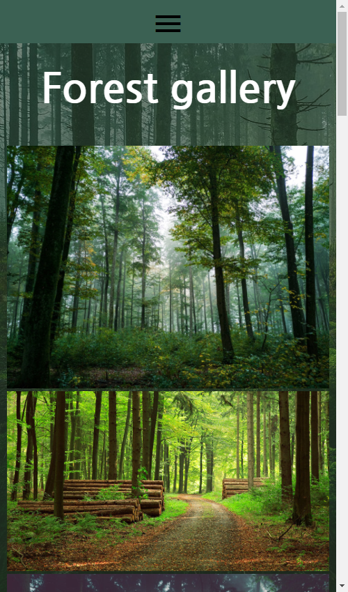
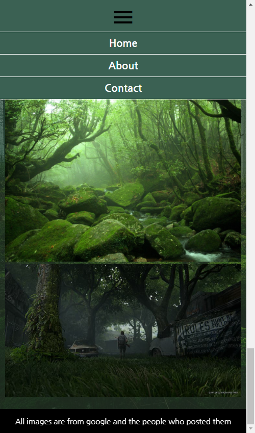

# Media query and Grid Task

The goal of this task is for you to use media query and grid to achieve a design similar to the reference images. 

## Intructions

- Start with the mobile design first. This way you will practice using the mobile-first design approach.
- Use a font from google fonts page, you are free to select the font you want.
- For the navbar use a checkbox to achieve the button effect.
- Use the image `background.jpg` as the background of the page. It has some opacity, please try to do this with a before pseudo element.
- Add the header with white color.
- All images should be below each other.
- Add the footer so it looks like the reference image.

- When finishing the mobile design expand the browser. At which point do you thing you should add the breakpoint for the media query?
- Use media query to change the design of the navbar so it looks like the reference image.
- In the same media query add the needed CSS rules to create a grid layout like the reference image.

